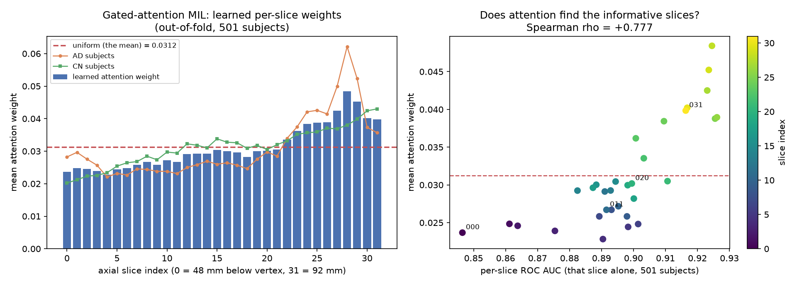

# Learned slice aggregation (attention-MIL) vs the plain mean — AD vs CN

**Script:** `scripts/slice_attention.py` · **Raw numbers:** `reports/slice_attention_result.json`
· **Figure:** `reports/figures/slice_attention_weights.png`
· **Head checkpoint:** `models/checkpoints/agg_gated_attention.pt`

**No model was retrained.** `models/checkpoints/mobilenetv2_ADvsCN.pt` was run **once** over all
16,032 slices of `data/manifest_v3_adcn.csv` (48 s on GPU, batch 32) and the 1280-d pooled feature
vector plus 2-d logits were cached. Every aggregation head was then fitted on those cached features
on CPU, in seconds. Class order `["CN","AD"]`, 3-channel input, `datasets.EVAL_TRANSFORM_RGB`.

---

## ⚠ Read this before quoting any number below

**The 5-fold CV numbers in this document are NOT estimates of deployment performance, and must
never be presented as new state-of-the-art results.**

The cached features come from a backbone that was **trained on the train split of this very
manifest** — 351 of the 501 subjects. Cross-validating over all 501 therefore evaluates every head
on subjects the *backbone* has already memorised to some degree. It is the same family of
contamination `scripts/leakage_proof.py` measured at +36.9 points, though not the same magnitude —
there a classifier was trained on leaked subjects, here only the frozen feature extractor saw them.
The inflation is directly visible: the mean head scores AUC **0.945** under CV versus **0.906** on
the 75 genuinely held-out test subjects, i.e. **+0.039 AUC of pure contamination** — eight times
the largest difference between any two heads in the table below.

The CV is valid for **one** thing, which is the thing this investigation is about: the **relative
comparison between aggregation heads**. Every head consumes byte-identical features, is fitted with
the identical protocol, and is exposed to the identical contamination, so the *difference* between
them is a fair comparison — and it is computed on 501 subjects instead of 75, which is the whole
reason for doing it.

**The honest headline for this project is unchanged: accuracy 0.827 [0.726, 0.896], ROC AUC 0.906
[0.830, 0.981] on 75 held-out subjects, using the plain mean.**

---

## Bottom line

**Keep the mean. No learned aggregation head beats it.**

- Two of the three learned heads (`max`, `logistic_on_stats`) are **significantly worse** than the
  mean — their paired-bootstrap ΔAUC intervals exclude zero on the wrong side.
- `gated_attention` (Ilse et al. 2018) lands **+0.005 AUC above the mean, with a paired-bootstrap
  interval of [−0.003, +0.012] that includes zero.** The direction is seed-stable (5/5 seeds above
  the mean), so it is probably a real effect — it is just far too small to act on: about three
  subjects out of 501, on numbers that are themselves contaminated (see below).
- The reason is measurable, and it is not "the head was trained badly": **an oracle reweighting that
  fits its weights on the true labels of all 501 subjects and is scored in-sample — a cheat that no
  honest head can beat — gains only +0.015 AUC over the mean.** There is almost no headroom for any
  linear slice reweighting to capture, because the 32 slice probabilities are ~0.77 correlated with
  each other and amount to roughly **1.3 independent measurements**, not 32.
- **The satisfying part:** the attention head *did* learn the right thing. Its weights climb
  monotonically toward the inferior slices, peaking at slice 28 at **1.55× uniform**, and correlate
  with the independently-measured per-slice AUC at **Spearman ρ = +0.78**. It rediscovered
  `docs/slice_informativeness.md` (decision 26) from scratch. It just doesn't help, because knowing
  which slices are best is worth almost nothing when all 32 are good and all 32 agree.

The literature claim that motivated this ("independent slice classification eliminates the
opportunity to learn cross-slice patterns") is not refuted in general — but on **this** backbone and
**this** 44 mm band it buys nothing measurable.

---

## Sanity gate: the cached-feature path reproduces the headline exactly

The script refuses to continue unless the `mean` head reproduces the published single-split result
to four decimals, so everything below is comparable to the project's headline number.

| | `reports/mobilenetv2_ADvsCN_v3adcn_result.json` | recomputed from the cache |
|---|---|---|
| subject-level accuracy | 0.8267 (62/75) | **0.8267** |
| subject-level ROC AUC | 0.9055 | **0.9055** |
| val-chosen threshold | 0.422 | **0.422** |

---

## 1. The existing single split (fit on 351 train, tune on 75 val, score 75 test)

This is the only *uncontaminated* comparison available — the test subjects here were never seen by
the backbone. It is also badly underpowered at n=75, which is why it cannot settle anything.

| head | accuracy | 95% CI | ROC AUC | 95% CI |
|---|---|---|---|---|
| **mean** (incumbent) | **0.827** | [0.726, 0.896] | **0.906** | [0.830, 0.981] |
| gated_attention | 0.813 | [0.711, 0.885] | 0.903 | [0.827, 0.979] |
| logistic_on_stats | 0.813 | [0.711, 0.885] | 0.894 | [0.815, 0.973] |
| max | 0.787 | [0.681, 0.864] | 0.897 | [0.818, 0.975] |

Every interval overlaps every other interval. **This table establishes nothing** — it is here to
show the direction of travel (nothing beats the mean) and to make the point that 75 subjects cannot
separate four heads whose AUCs span 0.012.

---

## 2. 5-fold subject-level CV over all 501 subjects — the headline comparison

Folds are stratified over **subjects**, never slices (same construction as
`scripts/cross_validate.py`: round-robin dealing of a shuffled per-class list), verified disjoint.
Within each fold a 15% stratified validation set is carved from the non-test subjects; the head's
hyperparameters, early-stopping point and decision threshold are all chosen there, never on test.
Fold sizes 101/100/100/100/100, AD per fold 44/43/43/43/43.

ΔAUC is a **paired** bootstrap (4,000 resamples over subjects, both heads scored on the same
resample) against the mean. Paired is the right test here: the heads score the *same* subjects, so
most of the sampling noise is shared and cancels. Comparing the two AUC intervals in the table by
eye instead would be wrong — those overlap heavily for every head, yet `max` and `logistic_on_stats`
are reliably worse on a per-subject basis.

| head | accuracy | 95% CI | ROC AUC | 95% CI | ΔAUC vs mean | 95% CI | verdict |
|---|---|---|---|---|---|---|---|
| **mean** | 0.864 | [0.831, 0.892] | 0.945 | [0.922, 0.967] | — | — | incumbent |
| gated_attention | 0.870 | [0.838, 0.897] | **0.949** | [0.928, 0.971] | **+0.0047** | [−0.0027, +0.0117] | **tie** |
| logistic_on_stats | 0.852 | [0.819, 0.881] | 0.935 | [0.911, 0.959] | −0.0097 | [−0.0167, −0.0031] | **worse** |
| max | 0.824 | [0.789, 0.855] | 0.931 | [0.906, 0.956] | −0.0137 | [−0.0245, −0.0036] | **worse** |

Majority baseline 0.569. Per-fold AUCs (mean head): 0.941 / 0.941 / 0.948 / 0.923 / 0.970.

Reading it:

- **`max` loses.** Expected — max-pooling stakes the whole subject on the single most AD-looking
  slice, which is the noisiest possible estimator when every slice is individually informative.
- **`logistic_on_stats` loses**, which is more interesting: seven order statistics of the 32
  probabilities carry *less* usable information than the plain mean, i.e. the extra statistics
  (std, min, max, quartiles) are noise that a logistic regression on ~340 subjects overfits. The
  mean is one of its own input features and it still could not improve on it.
- **`gated_attention` ties.** +0.0047 AUC with an interval straddling zero, and +0.006 accuracy =
  **three subjects out of 501**.

### Is the near-tie seed-stable?

A +0.005 gap that sits inside its interval could still be one lucky initialisation. The CV was
re-run under five different head initialisations with the folds held fixed:

| seed set | 1 | 2 | 3 | 4 | 5 | mean | sd |
|---|---|---|---|---|---|---|---|
| gated_attention CV AUC | 0.9483 | 0.9477 | 0.9501 | 0.9485 | 0.9474 | **0.9484** | 0.0009 |
| plain mean (deterministic) | | | | | | **0.9446** | — |

**The direction is seed-stable — all five initialisations land above the mean, and the seed-to-seed
sd (0.0009) is five times smaller than the gap (0.0038).** So the optimiser reliably finds a
slightly better ranking; this is not one lucky run.

**But seed noise is not the uncertainty that matters here — subject sampling is.** The gap is
+0.004 AUC, and the paired bootstrap over the 501 subjects puts it at [−0.003, +0.012]. In plain
terms: a real but sub-noise effect, worth roughly **three subjects of accuracy out of 501**, on
numbers that are themselves backbone-contaminated. That is not a basis for changing the pipeline.

---

## 3. Why nothing beats the mean — the headroom is simply not there

This is the part that makes the negative result solid rather than a failure to tune.

| quantity | value |
|---|---|
| mean pairwise correlation between the 32 slice probabilities | **0.772** |
| adjacent-slice correlation (~1.4 mm apart) | 0.929 |
| **effective number of independent slices** (var of the mean ÷ var of one slice) | **1.3 of 32** |
| per-slice ROC AUC range across the 32 indices (501 subjects) | 0.847 – 0.926 |
| plain mean | AUC 0.9446 |
| **oracle** linear reweight — weights fitted on the true labels of all 501, scored in-sample | AUC 0.9596 |
| **absolute ceiling for ANY linear slice reweighting** | **+0.015 AUC** |

The oracle is a deliberate cheat: it sees the test labels and is scored on the same data it was fit
on, so no honestly-fitted linear head can exceed it. It gains **+0.015 AUC**. The gated attention
head captured +0.005 of that, i.e. about a third of a ceiling that is itself inside the noise band
of a 501-subject estimate.

The mechanism is the correlation. Thirty-two axial slices 1.4 mm apart, read by one backbone, are
not 32 independent opinions about a subject — they are ~1.3 independent opinions restated 32 times.
Averaging highly-correlated estimators of *similar* quality is already near-optimal; reweighting
only helps when the members differ a lot in quality **and** their errors are somewhat independent.
Here the quality spread is narrow (0.847–0.926) and the errors are not independent. Both conditions
fail.

This also retro-explains decision 26: `docs/slice_informativeness.md` found that dropping slices
hurts and that "best slice" selection is mostly noise. Same underlying fact, approached from the
other side — the slices are near-redundant, so neither dropping them nor reweighting them moves the
result.

---

## 4. What the attention head learned (the satisfying convergence)

Out-of-fold attention weights, averaged over all 501 subjects (each subject's weights come from the
fold in which it was held out). Uniform — i.e. what the mean does — is 1/32 = 0.0312.

| region | attention mass | uniform would be | per-slice AUC there |
|---|---|---|---|
| inferior slices 24–31 (82–92 mm, temporal lobe / hippocampal level) | **0.332** | 0.250 | 0.910 – 0.926 |
| slices 8–11 (59–64 mm) | 0.106 | 0.125 | 0.892 – 0.898 |
| peak, slice 28 (87.7 mm) | 0.0484 = **1.55× uniform** | 0.0312 | 0.925 |
| minimum, slice 4 (53.7 mm) | 0.0228 = 0.73× uniform | 0.0312 | 0.890 |

- **Spearman(attention weight, per-slice AUC) = +0.777** across the 32 indices. The weights are
  **not** noise — the head independently rediscovered which slices carry signal.
- The profile climbs almost monotonically from slice 0 to slice 28, i.e. **toward the inferior end
  of the band**, which is exactly where `docs/slice_informativeness.md` measured the highest
  per-slice AUC (0.919 at slice 30 there, 0.926 at slices 25–26 here). Two independent methods —
  one measuring slices one at a time with a fixed model, one letting a trainable head choose —
  point at the same anatomy.
- **The weights are subject-adaptive, not just a fixed curve.** For true-AD subjects the profile
  peaks much harder at slice 28 (0.062) than for true-CN subjects (0.037), whose profile is nearly
  flat. The head concentrates on the temporal-lobe slices specifically when there is atrophy there
  to find. That is the behaviour attention-MIL is supposed to exhibit.
- Note the dynamic range is small: max/min = 2.12, and every weight is within [0.73×, 1.55×] of
  uniform. **The head converged to something very close to the mean, on purpose** — which is
  consistent with section 3 and is a good sign that it was trained properly rather than
  under-trained.

A caveat on the per-slice AUCs quoted in the right-hand panel: they are computed over all 501
subjects and so carry the same backbone contamination (0.847–0.926 here vs 0.777–0.919 on the 75
clean test subjects in decision 26). The *shape* is what matters and the shape agrees; the levels
are inflated.

---

## Recommendation

1. **Keep `groupby("subject_id")["p_AD"].mean()`.** It is the best-performing aggregator tested,
   it has no parameters, no threshold of its own, nothing to overfit, and no extra checkpoint to
   maintain. Nothing here justifies replacing it.
2. **Do not read the CV accuracies (0.82–0.87) as a result.** They are backbone-contaminated. The
   project's AD-vs-CN headline stays 0.827 / AUC 0.906 on 75 held-out subjects.
3. **Do not retry this on the same backbone.** The oracle ceiling of +0.015 AUC bounds *every*
   linear reweighting of these 32 slice probabilities, and the correlation structure that produces
   that ceiling is a property of the data (1.4 mm slice spacing over a 44 mm band), not of the head.
   Tuning hidden dims, dropout or optimisers cannot get past a bound derived with the labels in hand.
4. **If cross-slice modelling is revisited, it has to happen INSIDE the backbone, not after it.**
   The genuinely untested version of the literature's claim is a model that sees several slices at
   once and can build features spanning them (a 3D or slice-sequence encoder). Post-hoc reweighting
   of independently-computed per-slice probabilities — which is what every head here does, attention
   included — provably cannot recover cross-slice patterns, because the per-slice probabilities have
   already discarded them. This project's one attempt in that direction — the Phase D 2.5D
   three-adjacent-slice stacking, which failed on all three architectures — changed the
   normalisation at the same time (0.5/0.5 vs ImageNet constants), so it tested two variables at
   once. It is worth redoing cleanly before any 3D work.
5. **Prerequisite for any of that: fix decision 27 (acquisition-geometry anisotropy) first.** A
   depth-aware model consumes the slice axis directly, and the slice axis is currently the one that
   carries the un-corrected `SpacingBetweenSlices` bug.
