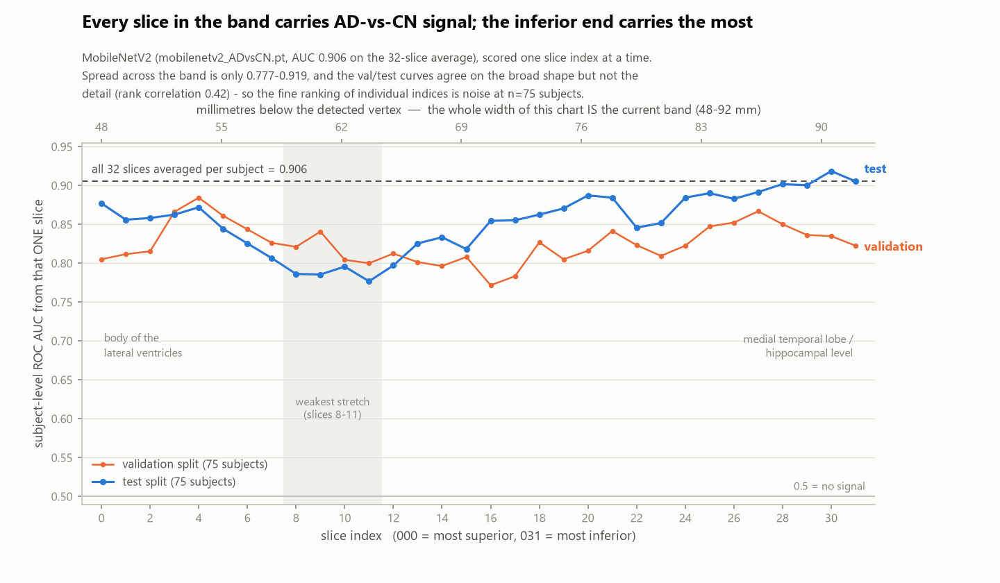

# Which axial slices actually carry the AD-vs-CN signal?

**Measurement only — no pipeline code was changed, nothing was retrained.** Inference on CPU with
the existing checkpoint `models/checkpoints/mobilenetv2_ADvsCN.pt`, built as
`models.build_mobilenetv2(2, pretrained=False)`, 3-channel input, `datasets.EVAL_TRANSFORM_RGB`,
class order `["CN", "AD"]` (CN=0, AD=1). Data: `data/manifest_v3_adcn.csv`, `split=="test"`
(75 subjects: 32 AD / 43 CN; 35 ADNI1 / 40 GO2) and `split=="val"` (75 subjects) — 2400 slices each.
Decision threshold **0.422** read from `reports/mobilenetv2_ADvsCN_v3adcn_result.json`
(`"decision_threshold"`), not hardcoded.

## Bottom line

**Leave the band alone.** All 32 slice indices are individually informative — every one of them
reaches ROC AUC between **0.777 and 0.919** on 75 test subjects. There are no dead slices diluting
the average. The best narrowing anyone could justify from validation data buys **+0.005 AUC and
+2 subjects of accuracy**, which is inside the noise at this sample size, and the two most
literature-motivated narrowings (the *centre* of the band) make things **measurably worse**.

The literature claim did not reproduce here, and the direction of the miss is informative: within
our 48–92 mm band it is the **inferior end** (temporal-lobe / hippocampal level, slices 24–31) that
is strongest and the **centre of our band** (slices 8–11, ~59–64 mm) that is weakest. "Centre
segments of the brain" in those papers means the middle of the *whole head*, which in our
millimetre-anchored coordinates is near the bottom of our band, not the middle of it. So the
literature and this measurement actually agree about anatomy; they disagree only about which
index range that anatomy lands on.

## Sanity check: the baseline reproduces exactly

| | reported in `mobilenetv2_ADvsCN_v3adcn_result.json` | recomputed here |
|---|---|---|
| subject-level accuracy | 0.8267 (62/75) | **0.8267 (62/75)** |
| subject-level ROC AUC | 0.9055 | **0.9055** |

Exact match to four decimals, so the re-implemented inference path is faithful and everything below
is comparable to the headline number.

## 1. Per-slice results (each row = that single slice index across all 75 test subjects)

`p_AD` columns are the mean predicted probability of AD, split by ground truth — the gap between
them is the raw separation that slice achieves. Accuracy uses the 0.422 threshold.

| slice | mm below vertex | accuracy | ROC AUC | mean p_AD (true CN) | mean p_AD (true AD) | sens | spec |
|---|---|---|---|---|---|---|---|
| 000 | 48.0 | 0.760 | 0.877 | 0.327 | 0.760 | 0.906 | 0.651 |
| 001 | 49.4 | 0.707 | 0.856 | 0.312 | 0.738 | 0.781 | 0.651 |
| 002 | 50.8 | 0.773 | 0.858 | 0.276 | 0.701 | 0.781 | 0.767 |
| 003 | 52.3 | 0.720 | 0.863 | 0.266 | 0.685 | 0.719 | 0.721 |
| 004 | 53.7 | 0.773 | 0.872 | 0.248 | 0.688 | 0.750 | 0.791 |
| 005 | 55.1 | 0.733 | 0.844 | 0.260 | 0.651 | 0.750 | 0.721 |
| 006 | 56.5 | 0.733 | 0.826 | 0.270 | 0.661 | 0.688 | 0.767 |
| 007 | 57.9 | 0.680 | 0.807 | 0.291 | 0.658 | 0.656 | 0.698 |
| 008 | 59.4 | 0.667 | 0.786 | 0.312 | 0.641 | 0.719 | 0.628 |
| 009 | 60.8 | 0.640 | 0.786 | 0.322 | 0.650 | 0.656 | 0.628 |
| 010 | 62.2 | 0.720 | 0.796 | 0.313 | 0.671 | 0.750 | 0.698 |
| 011 | 63.6 | 0.720 | **0.777** ← worst | 0.307 | 0.654 | 0.750 | 0.698 |
| 012 | 65.0 | 0.733 | 0.797 | 0.272 | 0.652 | 0.719 | 0.744 |
| 013 | 66.5 | 0.747 | 0.826 | 0.261 | 0.675 | 0.719 | 0.767 |
| 014 | 67.9 | 0.747 | 0.834 | 0.251 | 0.670 | 0.719 | 0.767 |
| 015 | 69.3 | 0.760 | 0.818 | 0.251 | 0.663 | 0.719 | 0.791 |
| 016 | 70.7 | 0.773 | 0.855 | 0.246 | 0.685 | 0.781 | 0.767 |
| 017 | 72.1 | 0.760 | 0.855 | 0.242 | 0.681 | 0.750 | 0.767 |
| 018 | 73.5 | 0.800 | 0.863 | 0.235 | 0.719 | 0.812 | 0.791 |
| 019 | 75.0 | 0.800 | 0.871 | 0.249 | 0.747 | 0.844 | 0.767 |
| 020 | 76.4 | 0.800 | 0.887 | 0.245 | 0.773 | 0.844 | 0.767 |
| 021 | 77.8 | 0.773 | 0.884 | 0.246 | 0.747 | 0.812 | 0.744 |
| 022 | 79.2 | 0.747 | 0.846 | 0.262 | 0.702 | 0.781 | 0.721 |
| 023 | 80.6 | 0.800 | 0.852 | 0.261 | 0.766 | 0.875 | 0.744 |
| 024 | 82.1 | 0.813 | 0.884 | 0.241 | 0.775 | 0.875 | 0.767 |
| 025 | 83.5 | 0.813 | 0.890 | 0.256 | 0.787 | 0.875 | 0.767 |
| 026 | 84.9 | 0.787 | 0.883 | 0.269 | 0.801 | 0.875 | 0.721 |
| 027 | 86.3 | 0.827 | 0.892 | 0.259 | 0.811 | 0.938 | 0.744 |
| 028 | 87.7 | 0.827 | 0.902 | 0.223 | 0.756 | 0.844 | 0.814 |
| 029 | 89.2 | 0.827 | 0.900 | 0.246 | 0.785 | 0.906 | 0.767 |
| 030 | 90.6 | 0.800 | **0.919** ← best | 0.228 | 0.773 | 0.844 | 0.767 |
| 031 | 92.0 | 0.827 | 0.906 | 0.215 | 0.728 | 0.812 | 0.837 |

Summary: min 0.777, median 0.857, max 0.919, sd 0.039. **No slice is uninformative** — the worst
single slice in the band still separates AD from CN at AUC 0.78, and every slice's mean p_AD for
true-AD subjects (0.64–0.81) is more than double its mean p_AD for true-CN subjects (0.22–0.33).

Shape (5-slice moving average of test AUC): 0.864 at slices 0–2 → a trough of **0.788** at slices
9–11 → a monotone climb to **0.908** at slice 31. A shallow U with a strong inferior arm, not a
peak in the middle.

## 2. Averaged-subset results (subject-level, 75 test subjects, threshold 0.422)

Each row averages `p_AD` over the listed slice indices per subject, then scores. The "recalibrated"
column re-derives the Youden-J threshold on the **validation** split for that same subset, because
the 0.422 threshold was fitted for the 32-slice average and a narrower subset shifts the
probability distribution.

| subset | slices | accuracy | 95% CI | ROC AUC | AUC 95% CI | recal. thr → acc |
|---|---|---|---|---|---|---|
| **all 32 (current baseline)** | 0–31 | **0.827** (62/75) | [0.726, 0.896] | **0.906** | [0.830, 0.981] | 0.422 → 0.827 |
| superior half | 0–15 | 0.760 (57/75) | [0.652, 0.842] | 0.853 | [0.761, 0.945] | 0.580 → 0.773 |
| inferior half | 16–31 | 0.840 (63/75) | [0.741, 0.906] | 0.911 | [0.838, 0.984] | 0.486 → 0.840 |
| centre 16 | 8–23 | 0.773 (58/75) | [0.667, 0.853] | 0.868 | [0.781, 0.956] | 0.557 → 0.773 |
| centre 8 | 12–19 | 0.800 (60/75) | [0.696, 0.875] | 0.860 | [0.769, 0.950] | 0.613 → 0.773 |
| ⚠ best-8 by **test** AUC | 20,24,25,27,28,29,30,31 | 0.840 (63/75) | [0.741, 0.906] | 0.927 | [0.861, 0.994] | 0.451 → 0.840 |
| ⚠ best-16 by **test** AUC | 0,2,3,4,18–21,24–31 | 0.867 (65/75) | [0.772, 0.926] | 0.922 | [0.853, 0.990] | 0.536 → 0.867 |
| best-8 by **val** AUC (unbiased) | 3,4,5,6,25,26,27,28 | 0.840 (63/75) | [0.741, 0.906] | 0.914 | [0.841, 0.986] | 0.431 → 0.840 |
| best-16 by **val** AUC (unbiased) | 3–7,9,18,21,22,25–31 | 0.853 (64/75) | [0.756, 0.916] | 0.911 | [0.837, 0.984] | 0.420 → 0.853 |
| inferior 8 (post-hoc, for reference) | 24–31 | 0.827 (62/75) | [0.726, 0.896] | 0.926 | [0.859, 0.993] | — |

### ⚠ The two "best by test AUC" rows are circular and optimistically biased

Ranking slice indices by their AUC **on the test set** and then reporting test accuracy for the
top-k reuses the same 75 subjects for selection and for evaluation. Those two rows are model
selection dressed up as a result and must never be quoted as performance. They are included only
so the size of the bias can be seen.

The **unbiased version was run** (rows 8–9): indices ranked by per-slice AUC on the **validation**
split, then evaluated once on test. Comparing the two directly measures the inflation:

| selection basis | best-16 AUC | best-16 accuracy |
|---|---|---|
| test-set ranking (circular) | 0.922 | 0.867 |
| validation ranking (honest) | 0.911 | 0.853 |
| inflation from circularity | **+0.011 AUC** | **+1.4 points** |

That is small here only because the per-slice differences are small to begin with; the
methodological point stands regardless.

### The per-slice ranking itself is not stable

Spearman rank correlation between the val and test per-slice AUC curves is **ρ = 0.415**
(p = 0.018). The two splits agree that the inferior end is good and that the band's exact middle is
weaker, but they disagree on almost every individual index: the best-8 lists share only **3 of 8**
indices (25, 27, 28) and the best-16 lists share **11 of 16**. Val's single best slice is 004;
test's is 030. Any recommendation of the form "keep exactly these eight indices" is fitting noise.

## 3. Is any subset genuinely better than all 32?

Paired bootstrap over the 75 test subjects (4000 resamples, same subjects resampled for both
members of each pair, so the comparison is paired and the shared-subject noise cancels):

| subset | ΔAUC vs all-32 | 95% CI | P(better) | Δaccuracy | subjects gained / lost |
|---|---|---|---|---|---|
| superior half 0–15 | **−0.052** | [−0.105, −0.011] | 0.004 | −0.067 | +0 / −5 |
| centre 16 (8–23) | **−0.037** | [−0.071, −0.009] | 0.002 | −0.053 | +0 / −4 |
| centre 8 (12–19) | **−0.046** | [−0.098, −0.002] | 0.021 | −0.027 | +2 / −4 |
| inferior half 16–31 | +0.006 | [−0.021, +0.035] | 0.649 | +0.013 | +2 / −1 |
| best-8 by val | +0.008 | [−0.034, +0.047] | 0.682 | +0.013 | +3 / −2 |
| best-16 by val | +0.005 | [−0.018, +0.027] | 0.682 | +0.027 | +3 / −1 |
| inferior 8 (24–31) | +0.020 | [−0.022, +0.065] | 0.816 | +0.000 | +3 / −3 |
| ⚠ best-8 by test (biased) | +0.022 | [−0.012, +0.063] | 0.890 | +0.013 | +3 / −2 |
| ⚠ best-16 by test (biased) | +0.016 | [−0.007, +0.044] | 0.908 | +0.040 | +3 / −0 |

Read this table as two findings, one negative and one null:

1. **Three narrowings are significantly WORSE than all 32** — the superior half, the centre 16 and
   the centre 8 all have ΔAUC intervals entirely below zero. Dropping the inferior slices costs
   real signal. The "centre segments matter most" hypothesis, applied literally to this band's
   index range, is refuted rather than merely unsupported.
2. **No narrowing is significantly better.** Every candidate improvement has a ΔAUC interval
   straddling zero, and even the biased test-selected subsets only reach P(better) ≈ 0.9. The best
   honest candidate (best-16 chosen on validation) moves accuracy by +2 subjects net (+3 gained,
   −1 lost) out of 75.

Calibration on the noise floor: the mean absolute AUC difference between **physically adjacent**
slices — two images ~1.4 mm apart, i.e. very nearly the same anatomy — is **0.0141**. Any subset
gap smaller than that cannot be interpreted as an anatomical effect. All the positive ΔAUCs above
are in that range or below.

## 4. What averaging actually buys

| | ROC AUC |
|---|---|
| mean over the 32 individual slices | 0.854 |
| best single slice (030), test-selected | 0.919 |
| all 32 averaged | 0.906 |

Averaging the whole band is worth **+0.05 AUC over a typical single slice** — that is variance
reduction across 32 noisy views of one brain, and it is the main thing the 32-slice average is
doing. It does **not** beat the best single slice, but "the best single slice" is only identifiable
in hindsight, and val/test disagree on which one it is, so it is not a usable strategy. The
averaging is not being diluted by junk; it is averaging 32 individually-decent estimates.

## Figure

`reports/figures/slice_informativeness.png` — per-slice subject-level ROC AUC for slice indices
0–31, test and validation split, with the 32-slice averaged AUC (0.906) as a dashed reference and
chance (0.5) as the baseline. The full width of the chart is the current band, with the secondary
top axis giving millimetres below the detected vertex. The y-axis extends to 0.5 deliberately: on a
truncated axis the 0.777–0.919 spread would look like a dramatic effect, and it is not.

## Recommendation

**Do not narrow the band. Keep `AXIAL_MM_BELOW_VERTEX = (48.0, 92.0)` and all 32 slices.**

Reasons, in order of strength:

1. Every slice index carries signal (AUC 0.78–0.92). The premise that the band contains
   uninformative slices diluting the average is **not supported** — there is nothing to remove.
2. The narrowings the literature review motivates (centre 8, centre 16) are **significantly worse**
   than the full band, not better.
3. The only narrowings that look better (inferior half, val-selected best-16) are inside the noise:
   +0.005 to +0.006 AUC, +1 to +2 subjects out of 75, with bootstrap intervals straddling zero.
   Adopting one would mean rewriting extraction and retraining every model to chase an effect the
   data cannot confirm — and would cut the training images per subject in half, which has its own
   cost that this analysis does not measure.
4. The current 82.7% / 0.906 result is the project's first statistically established finding
   (CLAUDE.md decision 13). Perturbing the dataset it was measured on, for an unconfirmable gain,
   risks that result for nothing.

**The one thing worth following up** is a *downward extension*, not a narrowing. AUC rises
monotonically from slice 12 to slice 30 and the strongest slices sit at 86–92 mm — the bottom edge
of the band. This checkpoint cannot say anything about what is below 92 mm, because it never saw
such slices; testing it would require a new extraction (e.g. 48–105 mm) and a retrain. Note the
curve is **plateauing rather than still climbing** (030 = 0.919, 031 = 0.906), so the honest
expectation is a small gain at best. Treat it as a hypothesis, not a finding — and note that a
purely inferior band would also move toward the orbits/sinuses, the noise region decision 3
originally backed away from.

If a narrowing is ever tried anyway, the honest protocol is: pick the indices on the **validation**
split (or by cross-validation), re-extract or re-subset, **retrain**, and evaluate once on test.
Selecting indices from this test set and re-reporting test accuracy — as the two ⚠ rows above do —
would produce a number that means nothing.

## Caveats

- **n = 75 test subjects (32 AD / 43 CN). One subject = 1.33 accuracy points.** Differences of a
  few points anywhere in this document are noise. The accuracy CIs are ~±9 points wide and every
  subset row's interval overlaps every other row's.
- All numbers come from **one checkpoint of one architecture**. CLAUDE.md records two separate
  episodes (the "masking hurts" story, the hi-res bottleneck story) where a clean-looking pattern
  from two of three architectures reversed on the third. A per-slice profile from
  `custom_cnn_ADvsCN.pt` and `efficientnet_b0_ADvsCN.pt` would be the cheap confirmation — same
  inference-only method, ~40 s per model on CPU.
- The model was **trained on all 32 indices jointly**, so the per-slice numbers measure "how well
  does the existing 32-slice model do when shown only this slice", not "how well would a model
  trained only on this slice do". A model trained exclusively on slices 24–31 might do better than
  0.926 — or worse, on 8× fewer images. That question needs training runs and is out of scope here.
- Per-slice sensitivity/specificity use the 0.422 threshold, which was fitted on validation for the
  32-slice **average**. Individual slices are differently calibrated (val-fitted per-subset
  thresholds range 0.42–0.61), so read the per-slice accuracy column as indicative and the AUC
  column as the threshold-free comparison.
- The scanning-site confound (CLAUDE.md decision 13, +8.0% over baseline) is untouched by this
  analysis; a slice-position effect and a site effect are not separated here.

---
*Generated 2026-08-17. Inference only — no training, no pipeline changes. Files written:
`docs/slice_informativeness.md`, `reports/figures/slice_informativeness.png`.*
